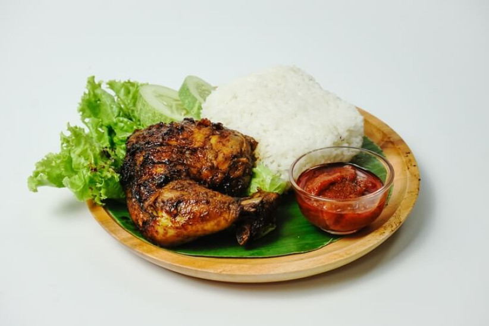

# website-catering
indeks.html
<!DOCTYPE html>
<html lang="id">
<head>
  <meta charset="UTF-8">
  <meta name="viewport" content="width=device-width, initial-scale=1">
  <title>Dapur Mama Hilda</title>
  <link href="https://cdn.jsdelivr.net/npm/bootstrap@5.3.3/dist/css/bootstrap.min.css" rel="stylesheet">
  
</head>
<body>

<header>
  
  <h1 class="fw-bold">DAPUR MAMA HILDA</h1>
  
Catering Lezat, Higienis, dan Terpercaya

</header>

  <h2 class="text-center mb-4 text-primary fw-semibold">Menu Kami</h2>

  <!-- Search Bar -->
  

    <input type="text" id="searchInput" class="form-control" placeholder="Cari kategori atau nama menu...">
  

  

    <!-- Menu Cards -->
    

      

        
        

          <h5 class="card-title fw-bold">Nasi Ayam Bakar</h5>
          
Nasi hangat dengan ayam bakar bumbu kecap, sambal, dan lalapan segar.

          
Rp25.000

        

      

    

    

      

        
        

          <h5 class="card-title fw-bold">Nasi Rendang</h5>
          
Nasi dengan rendang daging sapi empuk dan bumbu rempah khas Padang.

          
Rp28.000

        

      

    

    

      

        
        

          <h5 class="card-title fw-bold">Nasi Uduk</h5>
          
Nasi uduk gurih dengan telur balado, bihun goreng, dan tempe orek.

          
Rp22.000

        

      

    

    

      

        
        

          <h5 class="card-title fw-bold">Paket Prasmanan</h5>
          
Nasi putih, ayam rica, sayur asem, sambal, dan buah potong segar.

          
Rp35.000/porsi

        

      

    

  

<footer>
  <h5>Hubungi Kami</h5>
  
WhatsApp: <a href="https://wa.me/6281234567890" class="text-white fw-bold" target="_blank">+62 812-3456-7890</a>

  
Instagram: <a href="https://instagram.com/dapurmamahilda" class="text-white">@dapurmamahilda</a>

  
© 2025 Dapur Mama Hilda. Semua Hak Dilindungi.

</footer>

</body>
</html>
