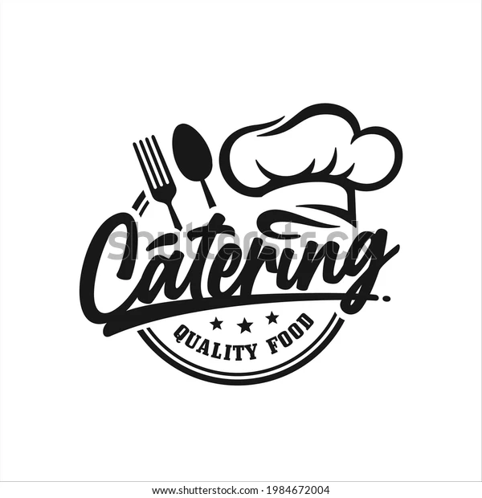
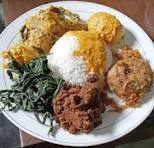
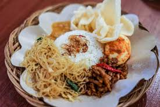
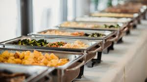

# website-catering

<!DOCTYPE html>
<html lang="id">
<head>
  <meta charset="UTF-8">
  <meta name="viewport" content="width=device-width, initial-scale=1">
  <title>Dapur Mama Hilda</title>
  <link href="https://cdn.jsdelivr.net/npm/bootstrap@5.3.3/dist/css/bootstrap.min.css" rel="stylesheet">
  
</head>
<body>

<header>
  
  <h1 class="fw-bold">DAPUR MAMA HILDA</h1>
  
Catering Lezat, Higienis, dan Terpercaya

</header>

  <h2 class="text-center mb-4 text-primary fw-semibold">Menu Kami</h2>

  <!-- 🔍 Pencarian -->
  

    <input type="text" id="searchInput" class="form-control" placeholder="Cari menu berdasarkan nama atau kategori...">
  

  <!-- 🔘 Tombol Filter -->
  

    <button class="btn btn-outline-primary filter-btn active" data-category="all">Semua</button>
    <button class="btn btn-outline-primary filter-btn" data-category="nasi">Nasi Box</button>
    <button class="btn btn-outline-primary filter-btn" data-category="prasmanan">Prasmanan</button>
    <button class="btn btn-outline-primary filter-btn" data-category="snack">Snack Box</button>
    <button class="btn btn-outline-primary filter-btn" data-category="minuman">Minuman</button>
  

  <!-- 🍱 Daftar Menu -->
  

    <!-- NASI BOX -->
    

      

        
        

          <h5 class="card-title fw-bold">Nasi Ayam Bakar</h5>
          
Ayam bakar bumbu kecap manis, sambal, dan lalapan segar.

          
Rp25.000

        

      

    

    

      

        
        

          <h5 class="card-title fw-bold">Nasi Rendang</h5>
          
Rendang daging sapi empuk dengan bumbu rempah khas Minang.

          
Rp28.000

        

      

    

    

      

        
        

          <h5 class="card-title fw-bold">Nasi Uduk Spesial</h5>
          
Nasi uduk gurih, ayam goreng, sambal kacang, dan telur balado.

          
Rp24.000

        

      

    

    <!-- PRASMANAN -->
    

      

        
        

          <h5 class="card-title fw-bold">Paket Prasmanan A</h5>
          
Nasi putih, ayam rica, sayur asem, sambal, dan buah potong.

          
Rp35.000/porsi

        

      

    

    

      

        
        

          <h5 class="card-title fw-bold">Paket Prasmanan B</h5>
          
Nasi putih, ayam kecap, tahu balado, sayur lodeh, dan kerupuk.

          
Rp40.000/porsi

        

      

    

    

      

        
        

          <h5 class="card-title fw-bold">Paket Prasmanan C</h5>
          
Nasi putih, ikan bakar, urap sayur, sambal matah, dan buah potong.

          
Rp42.000/porsi

        

      

    

    <!-- SNACK BOX -->
    

      

        
        

          <h5 class="card-title fw-bold">Snack Box A</h5>
          
Kue lumpur, risoles mayo, pastel isi ayam, air mineral kecil.

          
Rp18.000/box

        

      

    

    

      

        
        

          <h5 class="card-title fw-bold">Snack Box B</h5>
          
Bolu kukus, lemper ayam, kroket kentang, air mineral kecil.

          
Rp20.000/box

        

      

    

    

      

        
        

          <h5 class="card-title fw-bold">Snack Box C</h5>
          
Lapis legit, risoles sayur, donat tabur gula, air mineral.

          
Rp22.000/box

        

      

    

    <!-- MINUMAN -->
    

      

        
        

          <h5 class="card-title fw-bold">Es Teh Manis</h5>
          
Minuman segar teh melati manis dingin.

          
Rp5.000

        

      

    

    

      

        
        

          <h5 class="card-title fw-bold">Es Jeruk Segar</h5>
          
Perasan jeruk segar alami, tanpa bahan pengawet.

          
Rp6.000

        

      

    

    

      

        
        

          <h5 class="card-title fw-bold">Kopi Susu Dingin</h5>
          
Kopi robusta pilihan dicampur susu manis, disajikan dingin.

          
Rp10.000

        

      

    

  

  <!-- 🚫 Pesan jika tidak ada hasil -->
  
Menu tidak ditemukan 😔

<footer>
  <h5>Hubungi Kami</h5>
  
WhatsApp: <a href="https://wa.me/6281281948632" class="text-white fw-bold" target="_blank">+62 812-8194-8632</a>

  
Instagram: <a href="(https://www.instagram.com/renaldirey1?igsh=MXJnMGQxOTI4Ymx1dQ==)" class="text-white">@renaldirey1</a>

  
© 2025 Dapur Mama Hilda. Semua Hak Dilindungi.

</footer>

</body>
</html>

images/
logo.webp
nasi_ayam_bakar.jpg
